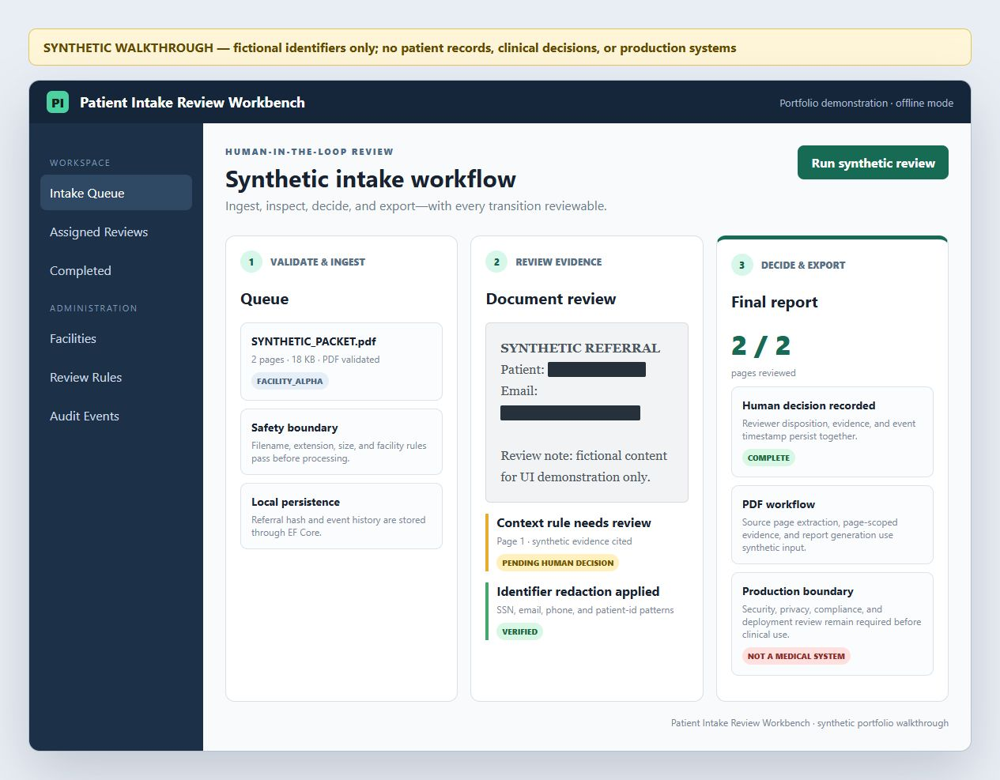
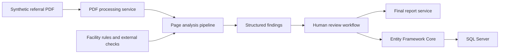

# Patient Intake Review Workbench

A privacy-safe portfolio edition of a Windows desktop workflow for ingesting referral documents, extracting structured findings, routing reviews, and producing final intake reports.



The image above is a clearly labeled synthetic walkthrough derived from the WPF workflow. It contains no patient data and is not a screenshot of a clinical or production system.

This repository intentionally contains **no patient documents, screenshots, databases, logs, credentials, production endpoints, or original Git history**. It demonstrates application architecture and workflow code only. Do not use it with real health information without a formal security, privacy, and compliance review.

## Engineering highlights

- .NET 8 WPF desktop application using MVVM-style view models
- Entity Framework Core with SQL Server migrations and repository-style stores
- PDF ingestion and page-level analysis orchestration
- Human-in-the-loop review states, findings, assignment, and transfer workflows
- Password hashing with per-user salts
- Facility-scoped rules and configurable external checks
- Final-report generation and audit-style referral events
- Light/dark application themes and multi-screen operational UI

## Architecture



The UI is separated into WPF views and view models. Services handle document processing, analysis, authentication, configuration, external checks, and report generation. Entity Framework stores persist users, facilities, referrals, review sessions, findings, rules, presence, and event history.

## Privacy boundary

The portfolio edition follows these rules:

- no real or realistic patient records;
- no medical PDFs or screenshots copied from the operational workspace;
- no user settings, connection strings, API keys, logs, databases, or build artifacts;
- demo accounts are disabled unless `PATIENTINTAKE_DEMO_PASSWORD` is explicitly set;
- configuration examples use generic facility identifiers only;
- a fresh Git history must be used for publication.

Only use unmistakably fictional fixtures such as `PATIENT_001` and `FACILITY_ALPHA` in future examples.

## Requirements

- Windows 10 or 11
- .NET 8 SDK
- SQL Server or SQL Server Express for persistence
- A Gemini API key only if testing the optional analysis integration

## Configuration

Set secrets outside the repository:

```powershell
$env:PATIENTINTAKE_DB_CONNECTION_STRING = "Server=localhost;Database=PatientIntakePortfolio;Trusted_Connection=True;TrustServerCertificate=True;"
$env:GEMINI_API_KEY = "your-development-key"
$env:PATIENTINTAKE_DEMO_PASSWORD = "choose-a-local-demo-password"
```

`PATIENTINTAKE_DEMO_PASSWORD` is optional. When absent, the application does not seed demo login credentials.

To customize generic facility rules, copy `PatientIntakeApp/config.example.json` to `PatientIntakeApp/config.json`. The runtime configuration file is ignored by Git.

## Build

```powershell
dotnet restore PatientIntakeApp/PatientIntakeApp.csproj
dotnet build PatientIntakeApp/PatientIntakeApp.csproj -c Release --no-restore
dotnet test PatientIntakeApp.Tests/PatientIntakeApp.Tests.csproj -c Release
```

GitHub Actions builds on Windows and runs synthetic tests for document/facility validation, sensitive identifier redaction, isolated configuration, SQLite persistence, and generated PDF extraction/subsetting.

## Repository map

| Path | Responsibility |
|---|---|
| `PatientIntakeApp/Views` | WPF screens and view bindings |
| `PatientIntakeApp/ViewModels` | UI state and workflow commands |
| `PatientIntakeApp/Services` | Analysis, PDF processing, authentication, configuration, and reporting |
| `PatientIntakeApp/Services/Stores` | Persistence abstractions for operational entities |
| `PatientIntakeApp/Data` | EF Core context, entities, and migrations |
| `PatientIntakeApp/Converters` | WPF display and visibility converters |
| `PatientIntakeApp.Tests` | Synthetic validation, redaction, configuration, persistence, and PDF tests |
| `docs` | Reviewer-safe walkthrough and 75-second demo script |

## Portfolio status

This is a sanitized engineering demonstration, not a production medical system. Production use would require threat modeling, access-control review, encryption and key management, audit retention, data-processing agreements, secure deployment controls, and applicable regulatory validation.

For a short portfolio review, follow [`docs/demo-script.md`](docs/demo-script.md) or open the self-contained [`docs/synthetic-walkthrough.html`](docs/synthetic-walkthrough.html).

## License

No public license has been selected. The code remains all rights reserved until the author explicitly chooses a license and confirms publication rights.
